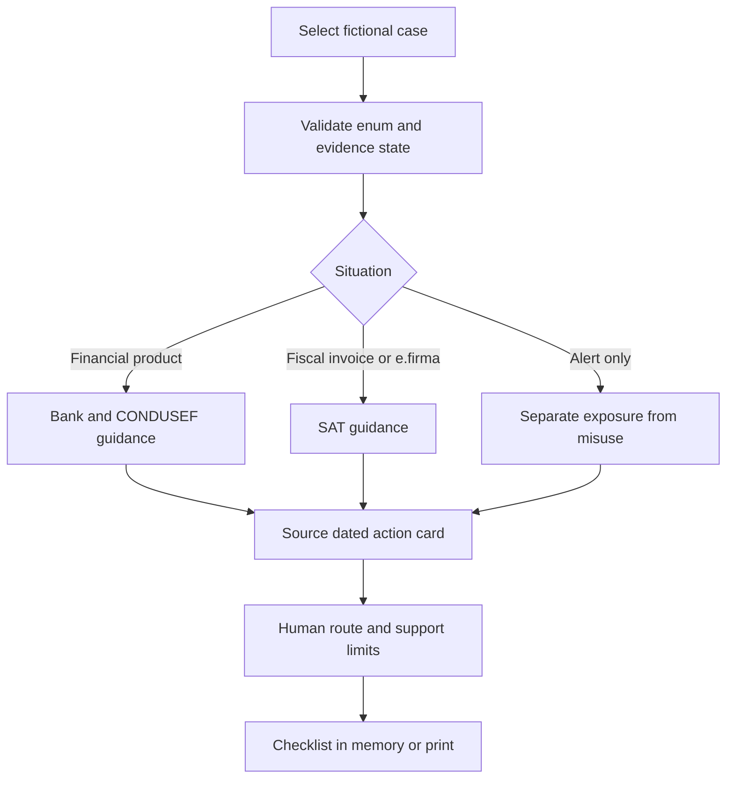
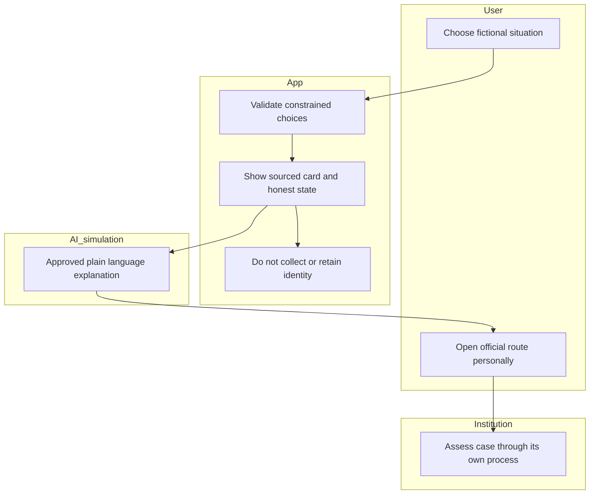

# Después de la alerta — Week 8 build packet

Yonathan Zeitoune Mattout · ADVERSARY · Team 6 · 30 September 2026

Written before feature code. Input: supplied `BLUEPRINT_WEEK8_TEAM6.pdf` (two pages). This packet implements Yonathan's declared next-action card, the backup/after slice of the team's SME Shield. It does not implement the other members' scanner, payer map or dental practice pilot.

## Problem and exact user
A Mexican micro-business owner reviewing the monthly close with their accountant encounters an invoice they do not recognize, or a person discovers a financial product they did not request. They need to distinguish financial identity misuse, fiscal identity misuse and a breach alert with no demonstrated misuse. An incomplete breach lookup is not proof of safety. There was no USER research role this week; this is a hypothesis from the supplied Blueprint, not a validated persona.

## Success before the module closes
At a working URL a reviewer chooses one of three fictional scenarios and one evidence state, obtains three bounded steps, a Mexican institutional route, clickable official sources, source review date, limits, and an explicit unfunded-human-support state. They can mark steps in memory, reset the case and print a card. A real, optional public HIBP breach-metadata request is visibly separate from fictional identity evidence and can fail without changing the case to safe.

## Image-generated mockup
The image-generated mockup is embedded in the submitted PACKET PDF and included in the downloadable source archive. It is a design reference, not screenshot evidence. If generation fails, document the omission rather than substituting a hand-drawn mockup and claiming it was generated.

## Flow

## Responsibility swimlane

## Global-to-local benchmark
The strongest existing recovery mechanism is the FTC's IdentityTheft.gov action plan. This slice localizes the sequence to sourced SAT/CONDUSEF routes and adds explicit unknown/failed states; it does not import US legal procedures. HIBP is the existing exposure-data benchmark; public metadata is not a CURP or Mexican government breach search. INCIBE 017 is a human-support benchmark, but its Spanish state-backed capacity is not copied by naming a chatbot.

## Three-year view
If this slice genuinely improves correct actions, an intermediary could attach it to monthly close, with funded human escalation and accountable source maintenance. Case records would require verified consent, authentication and owner-only access before storage. Without a committed payer and a comparison with free tools, the product remains an academic demo rather than a validated venture.

## Blueprint conditions as acceptance criteria
| Condition | Implementation and test |
|---|---|
| C1 No concentration | No text inputs, file uploads, identity lookup, account creation, database, storage or analytics. Only allowlisted fictional case IDs and evidence enums. |
| C2 Honest states | Confirmed fictional match / not found in demo / could not check; never safe, no risk score. API failure does not change evidence state. |
| C3 Human support | Same threshold in every case; suspected misuse points to institution, with no named funded app caseworker. Recovery promise explicitly removed. No tiers or overrides exist. |
| C4 Existing witness | Fiscal sample starts during monthly close with owner and accountant; owner makes decisions, receptionist never owns credential risk. |
| C5 Local sourced dated | Only official SAT/CONDUSEF action routes; visible review date and scope. After 30 days show route needs review and suppress detailed action claims. Links remain available as official references. |
| C6 Beat free options | Run task coverage analysis and functional tests on fictional cases against HIBP and official guidance. Do not claim more actual user actions completed, willingness to pay, revenue or a validated 10:1. |

## Scope cuts
No antivirus, password manager, scan of anyone's website, CURP search, stolen dataset, credential handling, fiscal revocation, complaint filing, financial transaction, automated communication, individual legal advice or live recovery service. No real personal data, no stored progress. Printed cards remain on the user's device.

## Architecture and stack
| Layer | Choice | Truthful status |
|---|---|---|
| UI | Accessible HTML/CSS/JS | Real case selection and printable card |
| Security tooling/API | HIBP public breach metadata via browser fetch, 8-second timeout; allowlisted destination validation and CSP | Real optional request; no individual account search; may be blocked or offline |
| Structured breach data | Three fictional cases + three evidence enums | Simulation, labeled on every view |
| LLM layer | Prewritten plain-language explanation, explicitly “IA simulada” | No live runtime model call or API key; course permits labeled simulated outputs |
| Storage | None, session memory only | Refresh/reset clears progress |
| Hosting | Static Sites output | No backend or personal-record tables |

No paid services. No secret is needed. Authentication and Supabase RLS are not applicable because no personal records are accepted or stored. This does not permit future personal-data storage without auth and RLS.

## Sources and review limits
- SAT, Revoca tu certificado de e.firma: https://wwwmat.sat.gob.mx/tramites/16659/revoca-tu-certificado-de-e.firma — reviewed 2026-09-30; describes free online/presential revocation; only the owner acts directly on official services. A warning on its legacy page means the demo does not attest transactional uptime.
- CONDUSEF, identity theft guidance: https://www.gob.mx/condusef/articulos/como-minimizar-el-riesgo-de-un-posible-robo-de-identidad — reviewed 2026-09-30.
- CONDUSEF official institutional site: https://www.condusef.gob.mx/ — institutional fallback; no guarantee of appointment or complaint acceptance. Search exposed newer RUT guidance, but fetching the detailed page failed, so do not hard-code a possibly obsolete filing form.
- HIBP API documentation: https://haveibeenpwned.com/API/v3 — public catalog is not victim exposure evidence.
- FTC benchmark: https://consumer.ftc.gov/stolen-identity-get-help-identitytheftgov
- Current LFPDPPP arts. 18–19: https://www.diputados.gob.mx/LeyesBiblio/pdf/LFPDPPP.pdf

## Test plan
1. Financial sample routes to institution and CONDUSEF, fiscal sample routes to SAT, alert-only sample makes no accusation of fraud.
2. All three evidence enums retain qualification; invalid enums rejected.
3. API failure/timeout stays “could not check”; no match and confirmed demo match never imply full identity coverage.
4. All external action URLs are HTTPS and on exact allowlisted hosts; malicious lookalike destinations rejected.
5. Stale source >30 days visibly requires review and suppresses detailed steps.
6. Checklist resets when case changes and on refresh; print includes fictional label, sources, date, limits and human-support disclaimer.
7. No file/credential inputs, localStorage, cookies, database, tracking or secret code.
8. Keyboard selection, mobile 390px, screen reader labels, no clipped CTA.
9. Log a genuine mechanical bug, fix, commit and redeploy. Do not manufacture a failure.
10. Synthetic persona walkthrough of screenshots, log confusion, fix worst confusion; explicitly not an interview or real-user outcome.

## Implementation prompt and commits
Implement constrained routing and honest evidence states first, then render the action card with source metadata. Keep runtime model output simulated and disclosed. Add public metadata separately; bind no user identifiers. At least five genuine commits: packet; route rules; first UI; tests/fix; persona and evidence; final documents. Publish once after initial functioning slice and again after documented fixes. Record actual commit hashes/deployments in DECISIONS.md.
