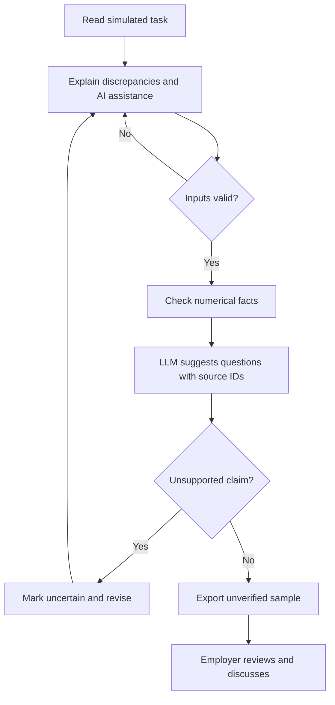
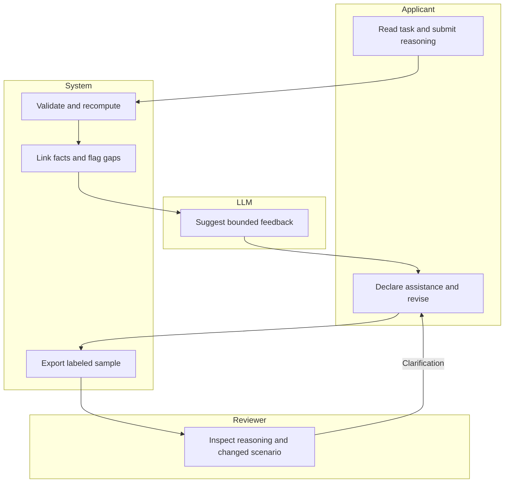

# Primera Prueba - Week 9 packet

Status: implementation packet finalized 8 October 2026 before application code. Grounded in the supplied Team 6 Blueprint dated 7 October. The actual User brief is unavailable; no interviewed persona is invented. Employer commitment is absent, so this is a training demo with no opportunity claim.

## Problem in my words
An entry-level operations applicant can have useful judgment without a formal work history. A polished explanation or AI-generated answer does not establish who can perform the work. A small, inspectable work sample can give a reviewer a better question to ask, but only if an employer agrees to review it and authorship limits remain visible.

## Exact user, pending USER research
Provisional segment: a Spanish-speaking applicant seeking a first operations/inventory role at a small Mexican retailer. This is a segment hypothesis, not an interviewed person. The employer reviewer is a second actor. Replace with the actual User brief before finalizing the packet or persona.

## Success definition
The team chose First-proof.  before the module closes a live demo should let a visitor complete one invented inventory task, see source-linked numerical checks, declare AI assistance, receive limited LLM feedback, revise an answer, and export the work sample for human discussion. Every screen must identify the task as a simulation and the card as unverified by an employer. No hiring decision is made.

## Screen and image-generated mockup
Spanish mobile-first task: show DEMO-01 through DEMO-04, cartons, units per carton, and requested units. Ask for discrepancy, missing evidence, and next action. The output separates 'Comprobaciones numéricas', 'Sugerencia de IA' and 'Revisión humana pendiente'. Generate the mockup before application code and retain the image in the packet deliverables. It is concept art, not a product screenshot.

## Flow

## Benchmarks
Forage is the main benchmark for a bounded employer-designed simulation. Adapt the task to Spanish inventory work. TestGorilla demonstrates reviewable criteria and AI roleplay; this demo borrows the distinction between outputs and reviewer judgment. Neither establishes demand for our slice. See RESEARCH.md.

## Three-year view
If employers actually use these samples, the product could become a small catalog of employer-agreed operations exercises with portable, narrowly scoped evidence. A later paid micro-experience could verify performance under a supervisor rather than just simulation completion. Expansion should stop wherever there is no reviewer commitment or where the assessment becomes unpaid productive labor.

## Scope cut
No CV builder, job board, universal employability score, candidate ranking, hiring prediction, identity certification, proctoring, facial analysis, real business data or automated job rejection. No employer partnership is claimed.

## Architecture and proposed stack
| Layer | Proposed implementation | Evidence boundary |
|---|---|---|
| UI | Buildless HTML/CSS/JavaScript, Spanish forms (framework deviation disclosed) | Demo; not yet implemented |
| Structured data | Invented typed JSON cases, versioned rubric and source IDs | No real company records |
| Numerical checks | Deterministic carton-to-unit validation | Arithmetic consistency, not authorship |
| LLM | Model-drafted prerecorded suggestions, explicitly simulated; no live API calls | Live LLM integration not implemented; suggestions cannot certify capability |
| Third stack element | Export automation: facts, answer, revisions, AI-use declaration | Export is an unverified work sample |
| Hosting/source | Vercel production and public Cuaderno/w09-first-proof source, to be verified after deployment | No live URL or repo yet |
| Personal data | Excluded from first demo | Any later personal storage requires auth and RLS |

Dragon floor is not yet satisfied by a deployed product. A research script and this planning conversation do not substitute for an application LLM integration.

## Proposed conditions for the team to accept or reject
1. Keep simulation completion, numerical checks, human observation and employer acceptance as separate states.
2. No universal score or automatic exclusion; missing data opens a correction path.
3. Employer reviewer commitment must exist before claiming the record unlocks an opportunity.
4. Disclose AI assistance. A follow-up changed scenario is discussion evidence, not a guaranteed anti-cheating mechanism.
5. Shadow clause: preserve dignity and control through visible criteria, access to one's artifact, correction and a human explanation; no productive unpaid work.
6. Use invented data and validated forms; label every unimplemented or simulated integration.

These are proposed conditions, not Team 6's decisions. Add the approved conditions and an implementation mapping before code.

## Test plan after Blueprint
Mechanical: validate empty and over-length reasoning, negative/fractional counts, missing packing, stale results after editing, explicit AI-use declaration, exported uncertainty labels and mobile layout. Record actual expected/observed results. When a real bug is discovered, preserve before evidence, fix, and redeploy; do not invent a defect to satisfy the checklist.

Persona: open a fresh chat using the actual USER research, walk through real screenshots in order, log confusion, fix the worst confusion, capture fresh screenshots and retest. This has not been performed.

Publication: at least five meaningful commits and two real deployments; verify the public live URL and repository link. Do not count the research spike as a deployment.

## Blueprint condition mapping
1. No new paper ceiling: no score, ranking or eligibility decision; optional record never harms someone without one.
2. Worker ownership: local download and print only; no backend, current-employer notification or referrals.
3. Narrow claims: four separate states; source-linked arithmetic, simulated AI and recorded-but-unverified counterfactual explanation.
4. No free labor: fictional training dataset only; no productive task.
5. Commitment: no named reviewer has committed, so employer accepted = not established; no hiring or revenue claim.
6. No entry barrier: no login, CV, bank account, RFC, file upload or paid tool. Existing evidence comes first.

## Build boundaries
The course's simulated-AI allowance is used: model-drafted suggestions are prerecorded and prominently labeled. The app does not call a live LLM and therefore does not demonstrate a live Dragon integration. It also uses HTML/JS rather than the Charter's Next.js/React stack; disclose this instead of claiming compliance.
Personal notes remain in browser memory only; export is an explicit local action. To keep screenshots and demo safe, use invented text only.

## Session close
Packet and build prompt finalized after receiving the Blueprint. Next: implement, commit the working slice, deploy, find real defects, repair, redeploy and retest. No interview, employer commitment or personal video is claimed.
